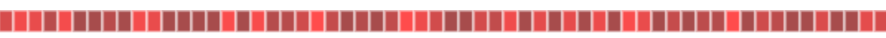

## Canvas Progress Bar

Currently plugin requires **canvas** object to be passed to the constructor call 
```javascript
 var progress = new DrawPorgress({
    canvas: canvasElement, 
    selectedProgressBar:2,
    progressTime: 10,
    onEndCallBack: callBackFunction
    })
```
At the moment plugin has three different types of progress bars. They can be set through the *selectedProgressBar* option. Default is set to 1     


first option will change color from red to dark grey during execution




on progress cycle complete *onEndCallBack* function can be called if provided 

[demo page](http://alex-volkov.github.io/canvas-progress-bar/)
